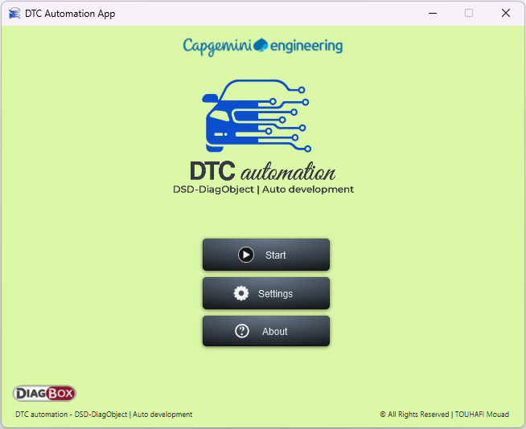
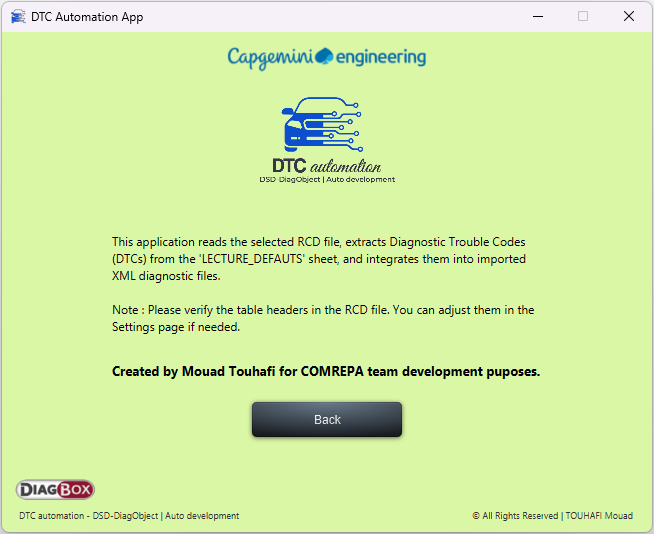
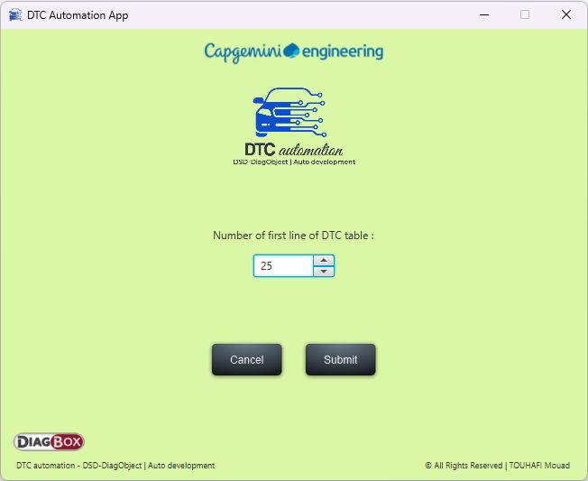
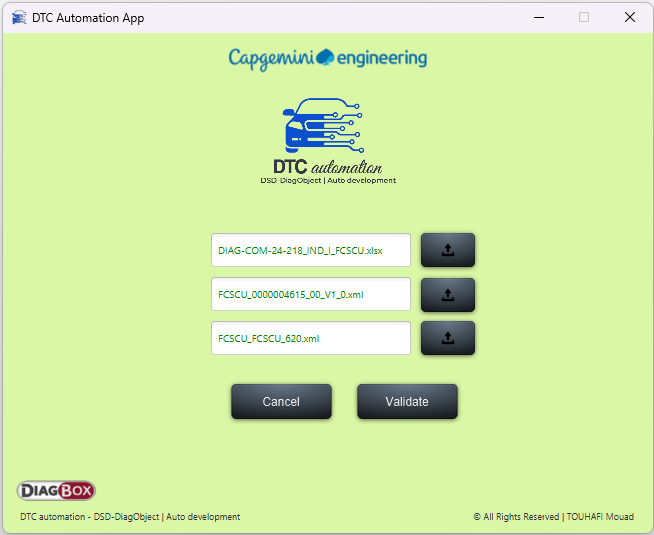
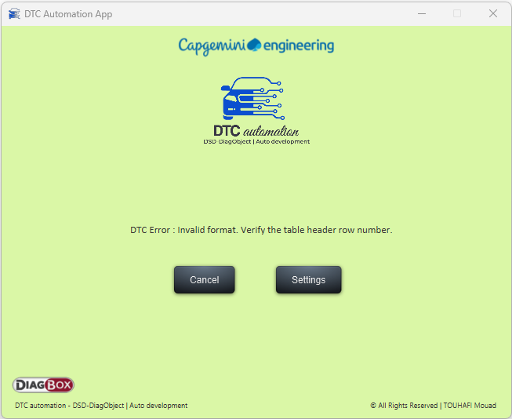
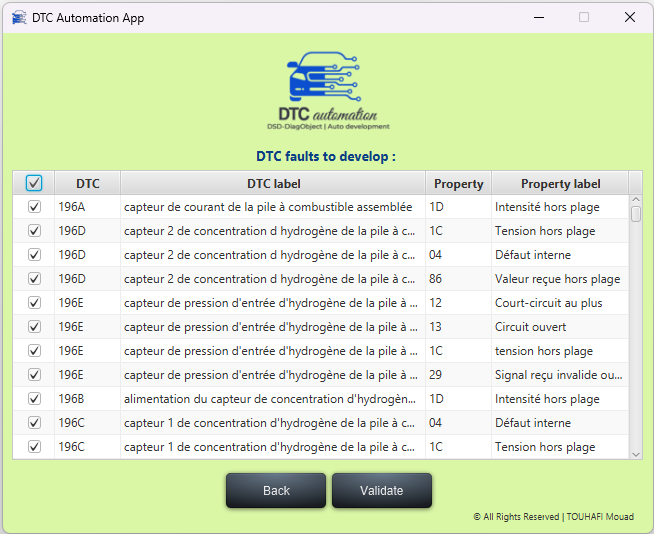
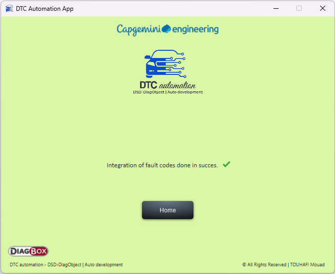

# 🛡️ DTC - DTC Automation App

This application is designed to assist with the integration of **Diagnostic Trouble Codes (DTCs)** into diagnostic XML files. It begins by reading the selected RCD file, specifically targeting the sheet that contains the **DTC** data table. Once the table is processed, the application matches and incorporates the extracted DTCs into the corresponding **XML diagnostic files** provided by the user.

---

## 🚀 Features

- 📂 RCD File Reader: Automatically loads and parses the DTC sheet inside an Excel file
- 🛠️ DTC Code Extraction: Reads and processes Diagnostic Trouble Codes (DTCs) with intelligent code conversion logic
- 📑 XML Integration: Integrates extracted DTCs into the appropriate nodes of imported XML diagnostic files
- 🔍 Mismatch Detection: Highlights and filters only new or unmatched DTC characterizations for review
- ✅ Manual Validation: Users can review and select which DTCs to integrate before applying changes
- ⚙️ Custom Settings: Modify the table structure based on your Excel file in a dedicated settings view
- 📋 About & Error Pages: Includes informative About page and custom error handling UI
- 🧰 JavaFX UI: Built with a responsive and clean JavaFX interface using FXML, CSS, and modular controllers
  
## 🧠 Tech Stack

| Layer         | Technology                           |
| ------------- | ------------------------------------ |
| UI Framework  | JavaFX (FXML, CSS)                   |
| Core Logic    | Java 21                              |
| File Handling | Apache POI (Excel), DOM Parser (XML) |
| Build Tool    | Maven                                |
| IDE           | Eclipse IDE                          |
| Architecture  | MVC (Model–View–Controller)          |

---

## ⚙️ Getting Started

### 🔧 Prerequisites

- Java 17+ (Java 21 recommended)
- Maven 3.8+
- A modern IDE (e.g., Eclipse, IntelliJ)
- (Optional) Git

## 📸 Screenshots of main pages

### 🗓️ Home Page

### 📬 About page

### 🗓️ Settings Page

### 🗓️ Import Files Page

### 🗓️ Errors Page

### 🗓️ Data Table Page (DTCs List)

### 🗓️ Integration Result Page (Status of Integration)

